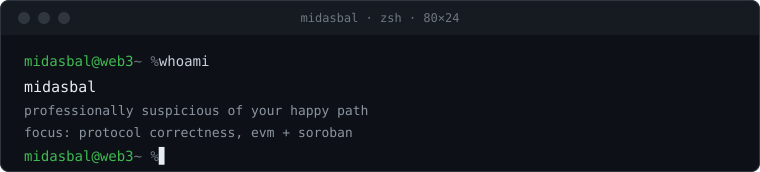

### `$` merged

**[Scale remaining order amounts exactly, not through basis points](https://github.com/ProjectOpenSea/seaport-js/pull/991)** &nbsp;`ProjectOpenSea/seaport-js#991` 
A basis-points detour under-scaled partial fills. On a 9 ETH order partially filled, the default fulfill path built a 5.9994 ETH transaction where the contract required 6, reverting an ordinary fill with `InsufficientNativeTokensSupplied`. Traced to a sibling fix that never reached these two functions, verified against seaport-core that the on-chain fill fraction is exact-or-revert, and covered by a regression test that fails on main with the exact wei mismatch.

**[Add a reusable chain_id query-param parser](https://github.com/getoptimum/optimum-common/pull/191)** &nbsp;`getoptimum/optimum-common#191` 
A single reusable uint64 chain_id parser for the shared library, closing the tracking issue and standardizing what had been two near-duplicate implementations across services. Shipped an option-based API first, then simplified to a single flag on maintainer review.

**[Allow hyphen in CAIP-2 namespace per spec](https://github.com/agentcommercekit/ack/pull/176)** &nbsp;`agentcommercekit/ack#176` 
A namespace regex rejected spec-legal hyphens. The fix also corrected a did:pkh test that had been passing only because of the same wrong pattern.

**[Exclude soft-deleted executions from workflow delete pre-check](https://github.com/KeeperHub/keeperhub/pull/2123)** &nbsp;`KeeperHub/keeperhub#2123` 
A soft-delete regression left the delete pre-check returning a false 409 for workflows whose run history had already been purged. Traced to the exact commit that moved executions to soft-delete without updating the guard, fixed by excluding the soft-deleted rows.

### `$` about

midasbal (Taylan Bal). Solo web3 developer, EVM and Soroban. Most of my useful work happens in the gap between what a contract promises and what it actually does. Currently moving into smart contract security and auditing, which is mostly this, with a job title.
